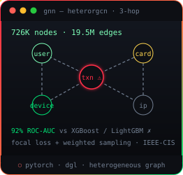

<div align="center">



<a href="https://linkedin.com/in/anuvik-thota"></a>
<a href="https://anuvik-portfolio.netlify.app/"></a>
<a href="mailto:anuvikt@gmail.com"></a>

<br/><br/>

<code>I build agentic AI systems — and the cloud infra that keeps them fast, observed, and cheap.</code>

<br/><br/>




</div>

<br/>


<div align="center">

<a href="https://github.com/ANUVIK2401/modelscope"></a>
<a href="https://github.com/ANUVIK2401/pacific-context-eval"></a>
<a href="https://github.com/ANUVIK2401/GNN-fraud-detection"></a>

</div>

| | Project | Proof of work | Stack |
|:--|:--|:--|:--|
| `04` | [**AgentDebugger**](https://github.com/ANUVIK2401/agent-debugger) | Paste a Python traceback → root-cause diagnosis, GitHub source context, diff patches, confidence scoring — [live demo](https://agentic-code-debugging.streamlit.app) | `gpt-4o-mini` `streamlit` |
| `05` | [**BrowserFlowAI**](https://github.com/ANUVIK2401/Browser-Flow-AI) | Natural language → planned browser workflow → structured data in ~2–5s, with visible AI planning and live execution logs — [live demo](https://browser-flow-ai.streamlit.app) | `playwright` `gpt-4o-mini` |
| `06` | [**LLM-MCP Travel Orchestrator**](https://github.com/ANUVIK2401/LLM-MCP-Travel-Orchestrator) | Live Airbnb search via MCP server + FAISS retrieval + RAG listing summaries with metadata fallback | `mcp` `faiss` `openai` |
| `07` | [**BuildSpec AI**](https://github.com/ANUVIK2401/Build-Spec-AI) | QA/QC copilot for construction specs — page-cited findings with severity & discipline tags — [live demo](https://build-spec-ai.streamlit.app) | `gpt-4o-mini` `streamlit` |
| `08` | [**Creator Discovery**](https://github.com/ANUVIK2401/creator-discovery) | Influencer marketing platform — TF-IDF semantic creator ranking, Kanban pipeline, AI brief generation — [live demo](https://creator-discovery-demo.vercel.app) | `typescript` `next.js` |
| `09` | [**DSA Patterns**](https://github.com/ANUVIK2401/DSA_Patterns) | 250 problems distilled into 25 reusable patterns — published as a searchable reference site | `python` `gh-pages` |
| `10` | [**Hybrid Recommender**](https://github.com/ANUVIK2401/Movie-Recommendation-System-on-Big-Data) | Model-based CF + item-CF hybrid on large-scale ratings — **published in Springer (2022)** | `pyspark` `xgboost` |

<br/>


```diff
+ 2026–now — MSRcosmos LLC · AI Forward Deployed SWE Intern
!        Production LangGraph multi-agent service on AWS — Sage X3 → Sage Intacct ERP migration
!        70% less manual reconciliation across thousands of GL/AP/AR records
!        Confidence-based human-in-the-loop validation · zero data loss, audit-ready
!        Sole engineer on Sage REST API + MCP agent tooling · handoff cycles: days → hours

+ 2025 — USC · AI/ML Research Intern
!        DQN reward + state-action redesign: RL training cycle 6+ hours → 10 minutes
!        Multi-GPU pipeline restructure → +18% agent task completion vs rule-based baselines
!        Distributed experiment tracking (REST + SQL) across 5+ parallel GPU runs

+ 2022–2025 — Oracle · Software Engineer II
!        Prometheus/Grafana observability for Oracle NSX across 37,000+ enterprise tenants
!        P1 MTTR 90 → 25 min (72%) · real-time diagnostics over 1M+ monitored endpoints
!        P1 on-call escalations −40% via automated root-cause tagging on 4xx/5xx failures
!        NetSuite SQL query-plan + index restructuring → 30% P50 latency cut
!        CLI toolchain adopted by 4 teams · release cycle −35% · K8s HPA on OCI, infra −25%

+ 2025–2026 — USC · MS Computer Science · GPA 3.85 (Dec 2026)
!        TA, CSCI 564 Big Data · AI Project Specialist, USC AI Trust Lab
```

<br/>


**`languages:`** &nbsp;      

**`ml_ai:`** &nbsp;     

**`llm_agents:`** &nbsp;      

**`infra:`** &nbsp;       

**`data:`** &nbsp;     

<br/>


<div align="center">


</div>

```text
/certs/oci-generative-ai-professional          Oracle Cloud Infrastructure
/certs/oracle-certified-professional-java-se8  Oracle
/papers/movie-recommendation-system-2022       Springer publication
```

<br/>

<div align="center">


<br/><br/>

```text
➜ ~ echo $OPEN_TO
LLM inference infra · applied ML · agentic systems · production ML systems
```

**`anuvikt@gmail.com`** · Los Angeles, CA

</div>
