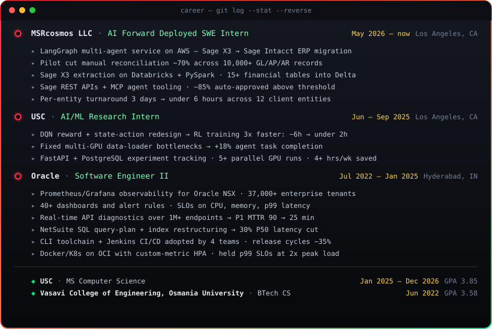

  

<code>I build agentic AI systems — and the cloud infra that keeps them fast, observed, and cheap.</code>

  

<table>
<tr>
<td width="50%" align="center"></td>
<td width="50%" align="center"></td>
</tr>
</table>

 

<table>
<tr>
<td width="33.3%" align="center"></td>
<td width="33.3%" align="center"></td>
<td width="33.3%" align="center"></td>
</tr>
</table>

| | Project | Proof of work | Stack |
|:--|:--|:--|:--|
| `04` | [**AgentDebugger**](https://github.com/ANUVIK2401/agent-debugger) | Paste a Python traceback → root-cause diagnosis, GitHub source context, diff patches, confidence scoring — [live demo](https://agentic-code-debugging.streamlit.app) | `gpt-4o-mini` `streamlit` |
| `05` | [**BrowserFlowAI**](https://github.com/ANUVIK2401/Browser-Flow-AI) | Natural language → planned browser workflow → structured data in ~2–5s, with visible AI planning and live execution logs — [live demo](https://browser-flow-ai.streamlit.app) | `playwright` `gpt-4o-mini` |
| `06` | [**LLM-MCP Travel Orchestrator**](https://github.com/ANUVIK2401/LLM-MCP-Travel-Orchestrator) | Live Airbnb search via MCP server + FAISS retrieval + RAG listing summaries with metadata fallback | `mcp` `faiss` `openai` |
| `07` | [**BuildSpec AI**](https://github.com/ANUVIK2401/Build-Spec-AI) | QA/QC copilot for construction specs — page-cited findings with severity & discipline tags — [live demo](https://build-spec-ai.streamlit.app) | `gpt-4o-mini` `streamlit` |
| `08` | [**Creator Discovery**](https://github.com/ANUVIK2401/creator-discovery) | Influencer marketing platform — TF-IDF semantic creator ranking, Kanban pipeline, AI brief generation — [live demo](https://creator-discovery-demo.vercel.app) | `typescript` `next.js` |
| `09` | [**DSA Patterns**](https://github.com/ANUVIK2401/DSA_Patterns) | 250 problems distilled into 25 reusable patterns — published as a searchable reference site | `python` `gh-pages` |
| `10` | [**Hybrid Recommender**](https://github.com/ANUVIK2401/Movie-Recommendation-System-on-Big-Data) | Model-based CF + item-CF hybrid on large-scale ratings — **published in Springer (2022)** | `pyspark` `xgboost` |

 

 

**`languages:`** &nbsp;      

**`ml_ai:`** &nbsp;     

**`llm_agents:`** &nbsp;      

**`infra:`** &nbsp;       

**`data:`** &nbsp;     

 

 

  

<code>➜ ~ echo $OPEN_TO</code>

<code>LLM inference infra · applied ML · agentic systems · production ML systems</code>

 

**`anuvikt@gmail.com`** · Los Angeles, CA

